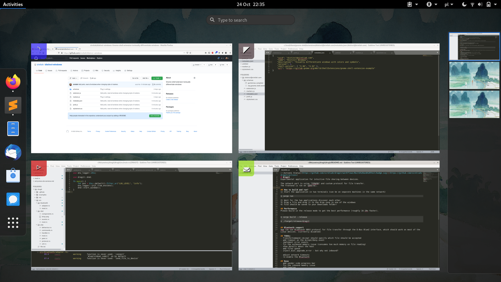
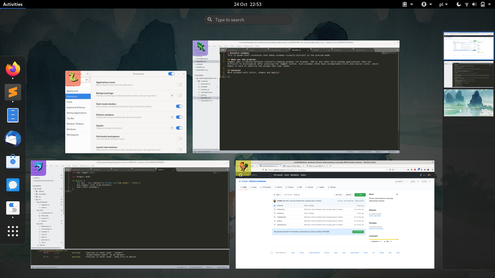

# Distinct windows
This is gnome-shell extension that makes windows visually distinct in the preview mode. 

## What was the problem?
Common case is having multiple similarly-looking windows (of browser, IDE or any other multi-window application) that are difficult to distinguish after pressing the `super` button. Such windows often have unremarkable title and similar color, which makes it hard to identify the window that user needs.

## Solution
Mark windows with colors, shapes and emojis!

### Shapes:

### Emojis:

